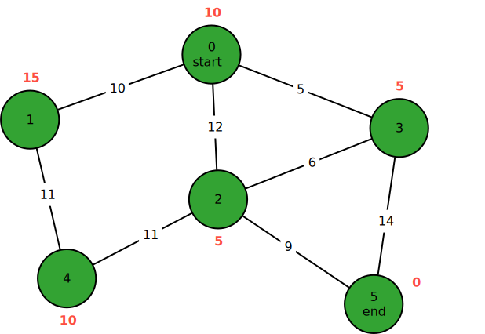
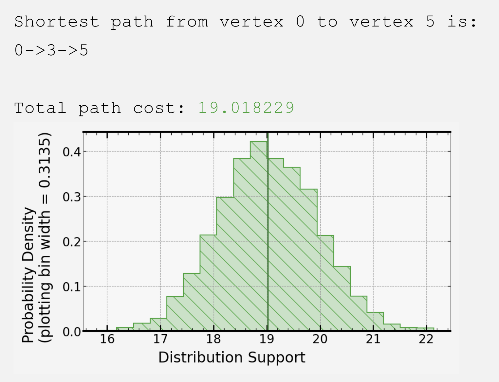

[](https://signaloid.io/repositories?connect=https://github.com/jagnoha/Signaloid-Demo-Robotics-AStarSearch#gh-dark-mode-only)
[](https://signaloid.io/repositories?connect=https://github.com/jagnoha/Signaloid-Demo-Robotics-AStarSearch#gh-light-mode-only)

# A\* Search Algorithm

This is an example implementation of the A\* search algorithm[^1], which searches a graph for the shortest path between two nodes. To improve performance, heuristics are used to prioritise paths that are most likely to be optimal.

The heuristic function estimates the cost of the cheapest path from each node to the destination node — if the heuristic function is guaranteed to never overestimate the actual path cost, then the A\* algorithm is guaranteed to find the optimal shortest path from start node to end node. An example of a heuristic function could be the Euclidean distance between a node and the destination node.

Since the heuristic function can only provide an estimate for path lengths, there may be an element of uncertainty in the heuristic values for each node. Another potential source of uncertainty is in the graph's edge weights, for example if they have been empirically determined by a robot operating in the real-world. Signaloid's uncertainty tracking technology allows the A\* algorithm to be implemented using uncertain variables, tracking uncertainty through to the final output.

In this example, we model uncertainty in heuristic values using a Gaussian distribution with standard deviation of 10% of the mean value. Uncertainty in graph edge weights is modelled using a Gaussian distribution with standard deviation of 5% of the mean value. These distributions have been picked arbitrarily for illustrative purposes — Signaloid's uncertainty tracking technology allows you to use any uncertainty distributions here.

## Detailed Example

As an example, consider the following weighted graph (this is the default graph for the application[^2]):



Each node in the graph has an associated name/identifier in the range `0 to 5`, as well as a heuristic value associated with it, e.g., `10` for node `0`. These heuristic values provide an estimate of the path length from each node to the destination node.

We aim to start at node `0` and aim to get to node `5` via the shortest path. If we run the application, the following output is produced:



The algorithm has determined the shortest path to be from `0` to `3` to `5`, with total path length `5 + 14 = 19`. The uncertainty in the final path length comes from the uncertainties associated with each edge weight in the graph.

## Application Inputs

The application accepts the following command line arguments:

- `[-i file]` _(Default: "input.csv")_:

  Path to input file defining the graph structure to traverse. The expected format of this file is described in detail below.

- `[-n number of nodes]` _(Default: 6)_:

  The number of nodes present in the graph defined in the input file.

- `[-s start node]` _(Default: 0)_:

  The ID of the node to start searching from.

- `[-e end node]` _(Default: 5)_:

  The ID of the destination node.

- `[-f heuristic standard deviation coefficient]` _(Default: 10%)_:

  Add Gaussian noise to the heuritic value. The noise is propotional to the value.

- `[-w edge weight standard deviation coefficient]` _(Default: 5%)_:

  Add Gaussian noise to the edge weight. The noise is propotional to the value.

- `[-h]`:

  Help flag to print a help message to stdout.

The graph is defined in a CSV file that the program reads from. The program expects the file to be formatted as follows:

- The first line in the CSV file contains the heuristic values for each node in the graph.
- Subsequent lines form an adjacency matrix defining the edge weights between nodes in the graph. A weight of zero represents a connection that does not exist, including connections between a node and itself.

As an example, here is the expected input file contents for the graph illustrated above:

```
10,	15,	5,	5,	10,	0,
0,	10,	12,	5,	0,	0,
10,	0,	0,	0,	11,	0,
12,	0,	0,	6,	11,	9,
5,	0,	6,	0,	0,	14,
0,	11,	11,	0,	0,	0,
0,	0,	9,	14,	0,	0,
```

[^1]: P. E. Hart, N. J. Nilsson and B. Raphael, "A Formal Basis for the Heuristic Determination of Minimum Cost Paths," in IEEE Transactions on Systems Science and Cybernetics, vol. 4, no. 2, pp. 100-107, July 1968, doi: 10.1109/TSSC.1968.300136.
[^2]: Sourced from Isaac Computer Science (https://isaaccs.org/c/dsa_search_a_star?examBoard=all&stage=all), with minor modifications
